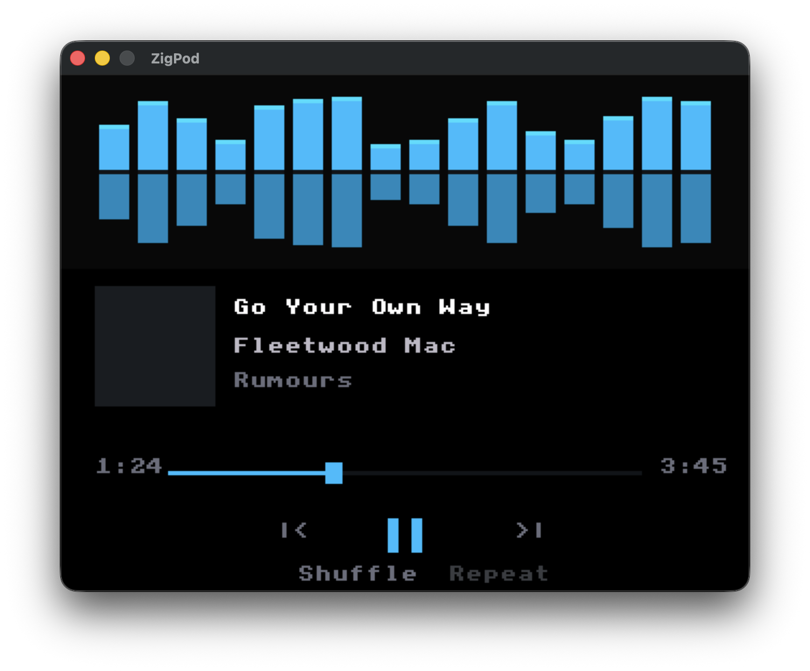

# ZigPod OS

A custom operating system for the Apple iPod Video (5th Generation), written entirely in Zig.

<p align="center">
  
  <br>
  <em>ZigPod Simulator with RetroFlow design - featuring animated waveform visualizer</em>
</p>

## Features

- **Native Audio Playback**: WAV, AIFF, FLAC, and MP3 support
- **Full Hardware Support**: LCD, click wheel, audio codec, storage
- **Complete Simulator**: Test without hardware using the PP5021C emulator
- **Modern Codebase**: Clean Zig implementation with 458+ unit tests

## Quick Start

### Prerequisites

- [Zig 0.15.2](https://ziglang.org/download/) or later
- Git
- SDL2 (optional, for GUI simulator)

### Build and Test

```bash
# Clone the repository
git clone https://github.com/Davidslv/zigpod.git
cd zigpod

# Run all tests
zig build test

# Run the simulator
zig build sim

# Run simulator with GUI (requires SDL2)
zig build sim -Dsdl2=true
```

## Using the Simulator

The simulator provides a complete PP5021C iPod emulation environment:

```bash
# Basic simulator with demo program
zig build sim

# With SDL2 graphical interface
zig build sim -Dsdl2=true

# Play audio file (GUI mode)
zig build sim -Dsdl2=true -- --audio path/to/music.wav

# Full options
zig build sim -- --help
```

**Simulator Controls:**

| Input | Action |
|-------|--------|
| Arrow keys | Navigate menu |
| Enter/Space | Select / Play-Pause |
| Escape | Menu |
| Q | Quit |

See [Simulator Guide](docs/008-simulator-guide.md) for complete documentation.

## Installing on Hardware

> **Warning**: Installing custom firmware carries risk. Always have a backup and test device.

### Prerequisites

1. iPod Video 5th/5.5th Generation
2. JTAG adapter (FT2232H recommended)
3. Working Disk Mode

### Installation Steps

1. **Test in simulator first** - Verify your build works
2. **Create backup** - Use Disk Mode to backup your device
3. **Follow safety protocol** - See [Hardware Testing Protocol](docs/006-hardware-testing-protocol.md)

```bash
# Build for ARM target
zig build -Dtarget=arm-freestanding-eabi

# Flash using JTAG tools (see hardware testing protocol)
zigpod-flasher install --image zig-out/bin/zigpod.bin
```

See [Hardware Testing Protocol](docs/006-hardware-testing-protocol.md) for safe deployment procedures.

## Supported Audio Formats

| Format | Bit Depths | Sample Rates | Notes |
|--------|------------|--------------|-------|
| **WAV** | 8/16/24/32-bit, float | Up to 192kHz | PCM and WAVE_FORMAT_EXTENSIBLE |
| **AIFF** | 8/16/24/32-bit | Up to 192kHz | AIFF and AIFF-C |
| **FLAC** | 8-24 bit | Up to 192kHz | All compression levels |
| **MP3** | N/A | 32-48kHz | VBR/CBR 32-320 kbps |

## Project Structure

```
zigpod/
├── src/
│   ├── main.zig           # Entry point
│   ├── hal/               # Hardware Abstraction Layer
│   ├── kernel/            # Kernel (memory, interrupts, timer)
│   ├── drivers/           # Device drivers
│   ├── audio/             # Audio engine and decoders
│   ├── ui/                # User interface
│   ├── library/           # Music library (iTunesDB)
│   ├── simulator/         # PP5021C simulator
│   └── tools/             # JTAG, flasher, recovery tools
├── docs/                  # Documentation
├── linker/                # Linker scripts
└── build.zig              # Build configuration
```

## Documentation

### User Documentation

| Document | Description |
|----------|-------------|
| [User Guide](docs/007-user-guide.md) | Using ZigPod on your device |
| [Simulator Guide](docs/008-simulator-guide.md) | Running and using the simulator |

### Developer Documentation

| Document | Description |
|----------|-------------|
| [Project Vision](docs/001-zigpod.md) | Project goals and guidelines |
| [Implementation Plan](docs/003-implementation-plan.md) | Development phases |
| [Hardware Reference](docs/004-hardware-reference.md) | PP5021C registers and memory map |
| [iTunesDB Format](docs/005-itunesdb-format.md) | Music database format specification |

### Hardware Documentation

| Document | Description |
|----------|-------------|
| [Hardware Testing Protocol](docs/006-hardware-testing-protocol.md) | Safe hardware validation procedures |
| [Safe Init Sequences](docs/005-safe-init-sequences.md) | Verified initialization sequences |
| [Recovery Guide](docs/006-recovery-guide.md) | Device recovery procedures |

## Target Hardware

| Component | Specification |
|-----------|---------------|
| **Model** | iPod Video 5th Gen (A1136) |
| **SoC** | PortalPlayer PP5021C |
| **CPU** | Dual ARM7TDMI @ 80 MHz |
| **RAM** | 32MB / 64MB SDRAM |
| **Display** | 320x240 QVGA LCD |
| **Audio** | Wolfson WM8758 codec |
| **Storage** | 30-80GB HDD or iFlash adapter |

## Development

### Running Tests

```bash
# Run all tests (458+ tests)
zig build test

# Run with verbose output
zig build test 2>&1 | less
```

### Code Quality

```bash
# Check formatting
zig build fmt-check

# Auto-format
zig build fmt
```

### Development Workflow

1. Write tests first
2. Implement with mock HAL
3. Test in simulator
4. Deploy to hardware (with backup!)

## Safety Guidelines

Before deploying to real hardware:

1. **Always test in simulator first**
2. **Create and verify backups**
3. **Follow the [Hardware Testing Protocol](docs/006-hardware-testing-protocol.md)**
4. **Never flash the boot ROM**
5. **Keep a recovery device available**

## Contributing

Contributions welcome! Please:

1. Fork the repository
2. Create a feature branch
3. Write tests for new functionality
4. Ensure all tests pass (`zig build test`)
5. Submit a pull request

## Research Sources

- [Rockbox](https://github.com/Rockbox/rockbox) - Primary hardware reference
- [iPodLoader2](https://github.com/crozone/ipodloader2) - Bootloader reference
- [freemyipod.org](https://freemyipod.org) - Community resources

## License

MIT License - See [LICENSE](LICENSE) for details.

## Acknowledgments

- The [Rockbox](https://www.rockbox.org/) project for hardware documentation
- iPod Linux and freemyipod.org communities
- PortalPlayer reverse engineering contributors
